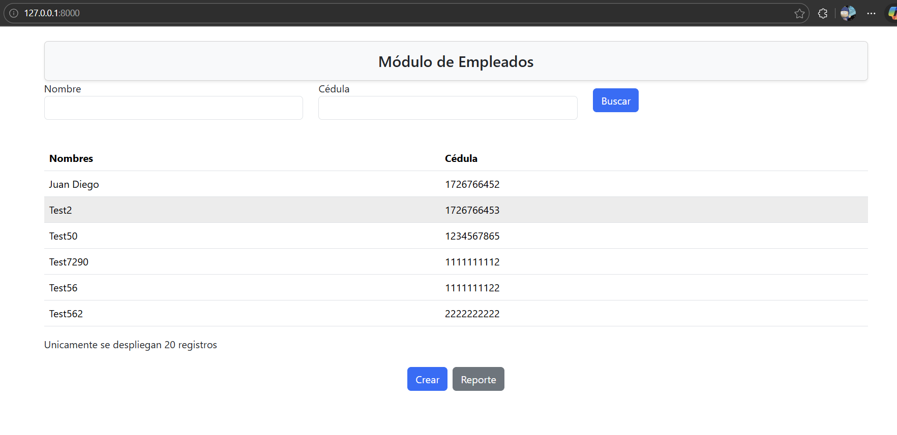
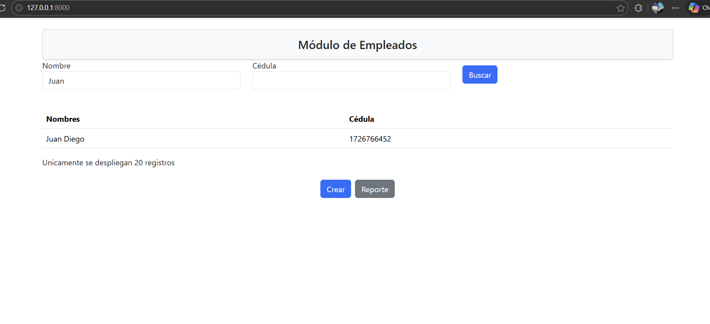
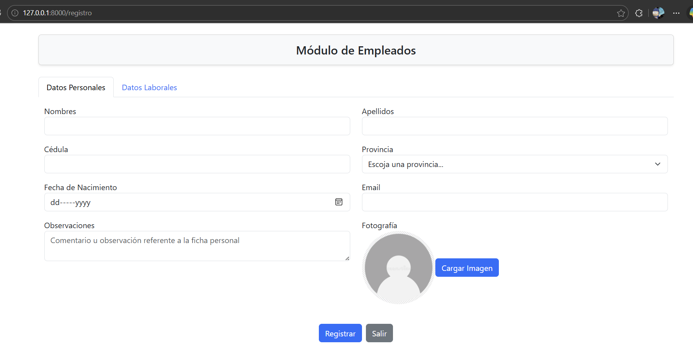
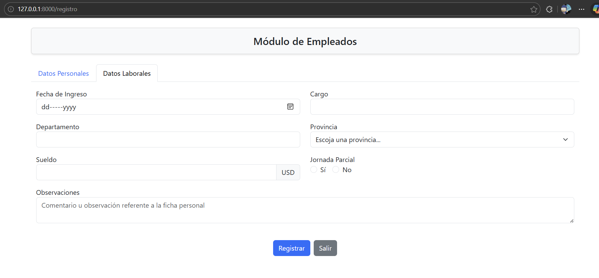

# Test técnico 
**Nombre:**Juan Diego Bahamonde Tonato 
## Herramientas y lenguajes usandos

1. php (8.4.0)
2. laravel (13.2.0)
3. mysql
4. react (18.2.0)

## Recomendaciones 
1. Ejecutar npm
    ```bash

    npm instal
    ```
2. Base de datos
    1. Puede ejecutar las migraciones y los seeders
    ```bash

    php artisan migrate
    ```
    y luego 
    ```bash

    php artisan make:seeder PersonaSeeder
    php artisan make:seeder EmpleadoSeeder
    ```
    2. O crear la base de datos con el archivo provedatosJuanBahamonde.sql
3. Configurar el archivo .env con la conexion a la base de datos 
4. Para la ejecucion 
    ```bash

    php artisan serve
    npm 
    ```


## Galeria








